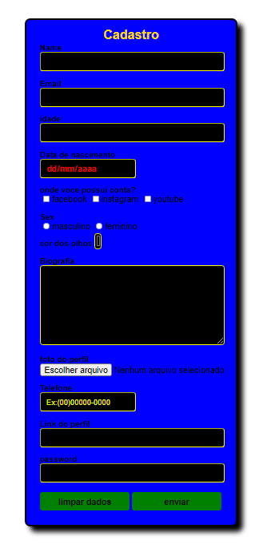

> CodeClub course registration project, completed.

### Ajustes e melhorias

O projeto ainda está em desenvolvimento e as próximas atualizações serão voltadas nas seguintes tarefas:

- [x] HTML
- [x] CSS
- [ ] Javascript

<table>
  <tr>
    <td align="center">
      <a href="#">
         
        
          <b>Gabriel Mori</b>
        
      </a>
    </td>
  </tr>
</table>

[⬆ Voltar ao topo](#nome-do-projeto) 
